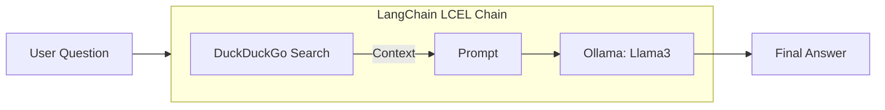

# LangChain Assistant (Project 10)

This project implements a **Real-Time AI Assistant** using LangChain, RAG (Retrieval-Augmented Generation), and local inference via Ollama. 

The assistant can answer questions by performing live web searches through DuckDuckGo, ensuring its knowledge is up-to-date.

## Features

- **Real-Time Retrieval**: Uses `DuckDuckGoSearchRun` to fetch live data from the web.
- **Local LLM**: Powered by `llama3:8b` running on your local machine via **Ollama**.
- **LangChain LCEL**: The logic is orchestrated using LangChain Expression Language for a clean, piped architecture.
- **Privacy-First**: No paid APIs or external tracking; search and LLM orchestration happen locally (except for the search query to DuckDuckGo).

## Architecture



## Setup

1.  **Install Ollama**: Download from [ollama.com](https://ollama.com).
2.  **Pull the Model**:
    ```bash
    ollama pull llama3:8b
    ```
3.  **Install Dependencies**:
    ```bash
    pip install -r requirements.txt
    ```
4.  **Run the Assistant**:
    ```bash
    python src/main.py
    ```

## Example Usage

**You**: What is the current price of Bitcoin?
**Assistant**: Looking that up... (Searches web) ... Based on the latest search results, the current price of Bitcoin is...

## Testing

Run unit tests:
```bash
pytest tests/
```
