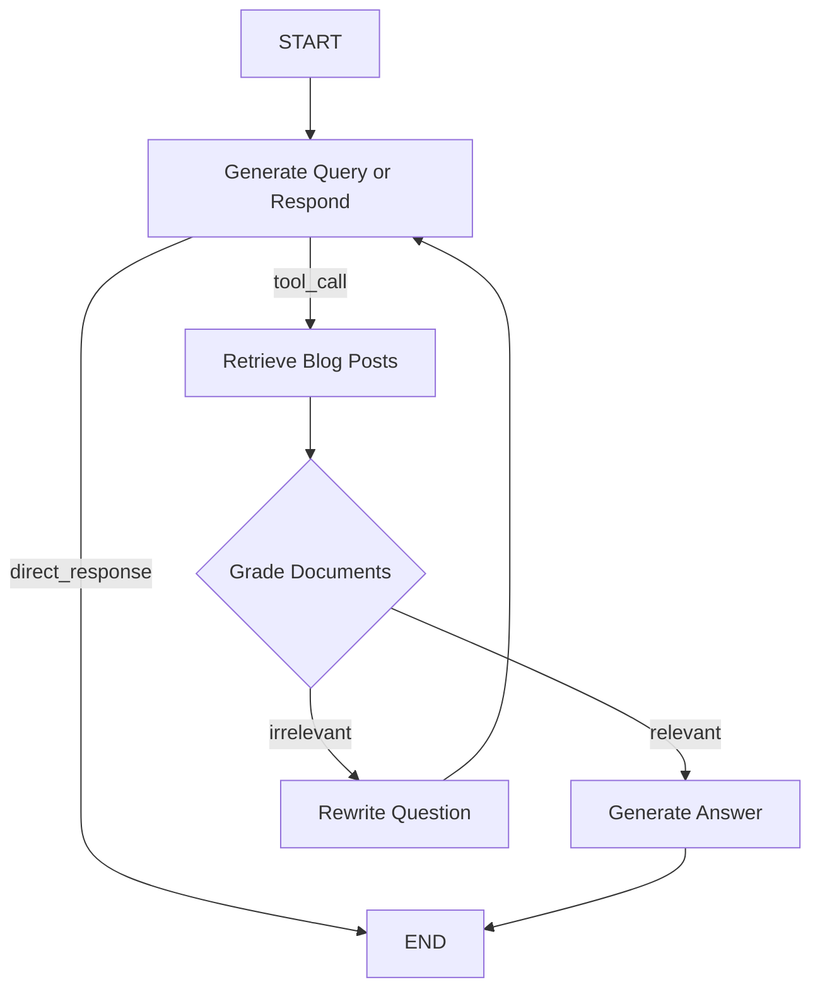

# LangGraph Retrieval Agent (Project 11)

This project demonstrates an **Agentic RAG System** built using **LangGraph**. Unlike standard RAG pipelines, this agent can decide whether to retrieve dynamic context using tools, grade the relevance of retrieved documents, and rewrite the user's query if initial searches fail.

## Features

- **Dynamic Routing**: The agent decides to either call the `retrieve_blog_posts` tool or respond directly.
- **Relevance Grading**: A dedicated grading node assesses whether the retrieved content actually answers the user's query.
- **Self-Correction Loop**: If search results are deemed irrelevant, the agent rewrites the question and attempts retrieval again.
- **LangGraph State Management**: Uses `MessagesState` to track the conversation history and tool interactions across nodes.
- **Ollama Integration**: Runs locally using `llama3:8b`.

## Architecture



## Setup

1.  **Install dependencies**:
    ```bash
    pip install -r requirements.txt
    ```

2.  **Pull the Ollama model**:
    ```bash
    ollama pull llama3:8b
    ```

3.  **Run the application**:
    ```bash
    python src/main.py
    ```

## Testing

Run unit tests:
```bash
pytest tests/
```
